# Chrome Extension Flow - Google Voice AI Discussion

This diagram shows how the different components of the Chrome extension interact to provide AI-powered responses in Google Voice conversations.

```mermaid
graph TD
    A["👤 User opens Google Voice"] --> B["📄 Content Script Loads<br/>(pages/content/src/index.ts)"]
    B --> C["🔍 Detects Google Voice Message List<br/>(gv-text-message-list)"]
    C --> D["🎛️ Injects AI Discussion Toggle<br/>(injectAiDiscussionToggle)"]
    
    D --> E{"🤔 User toggles AI Discussion ON?"}
    E -->|No| F["❌ Feature remains inactive"]
    E -->|Yes| G["📊 Initialize Conversation Context<br/>(initializeConversationContext)"]
    
    G --> H["📑 Parse Messages<br/>(getVoiceTextFromNumber)"]
    H --> I["💬 Extract conversation history<br/>from DOM elements"]
    I --> J{"📝 Is last message from other person?"}
    
    J -->|No| K["ℹ️ Log: Most recent message is from us"]
    J -->|Yes| L["🚀 Send to Background Script<br/>(sendToLLM)"]
    
    L --> M["🔄 Background Script Receives Request<br/>(pages/background/src/index.ts)"]
    M --> N["🌐 Make Fetch Request to Ollama API<br/>(http://localhost:11434/api/generate)"]
    
    N --> O["🤖 Ollama API"]
    O --> P["🧠 DeepSeek R1 Model<br/>(deepseek-r1:1.5b)"]
    P --> Q["💭 Generate AI Response"]
    Q --> R["📤 Return Response to Background Script"]
    
    R --> S["📨 Background Script sends response<br/>back to Content Script"]
    S --> T["✏️ Content Script fills text input<br/>(postLLMResponse)"]
    T --> U["📩 Auto-send message in Google Voice"]
    U --> V["📝 Update conversation context<br/>with AI response"]
    
    V --> W["👀 Continue monitoring for new messages<br/>(processNewMessages)"]
    W --> X["🔄 MutationObserver watches DOM"]
    X -->|"New message detected"| Y["📨 New incoming message?"]
    
    Y -->|Yes| L
    Y -->|No| X
    
    style A fill:#e1f5fe
    style B fill:#f3e5f5
    style O fill:#fff3e0
    style P fill:#fff3e0
    style D fill:#e8f5e8
    style U fill:#e8f5e8
    
    classDef userAction fill:#e1f5fe,stroke:#01579b,stroke-width:2px
    classDef contentScript fill:#f3e5f5,stroke:#4a148c,stroke-width:2px
    classDef backgroundScript fill:#fff8e1,stroke:#ff8f00,stroke-width:2px
    classDef ollamaAPI fill:#fff3e0,stroke:#ef6c00,stroke-width:2px
    classDef success fill:#e8f5e8,stroke:#2e7d32,stroke-width:2px
    
    class A userAction
    class B,H,I,L,S,T,V,W,X contentScript
    class M,N,R backgroundScript
    class O,P,Q ollamaAPI
    class D,U success
```

## 🔧 Key Components

### **1. Content Script** (`pages/content/src/index.ts`)
- **Main orchestrator** that runs on Google Voice pages
- Injects the AI Discussion toggle UI
- Monitors for new messages using MutationObserver
- Handles message parsing and response posting
- Manages conversation state and context

### **2. Message Parser** (`pages/content/src/getVoiceTextsFromNumber.ts`)
- Extracts structured conversation data from Google Voice DOM
- Parses message text, authors, and timestamps
- Provides conversation history for AI context

### **3. Background Script** (`pages/background/src/index.ts`)
- **CORS proxy** for Ollama API requests
- Handles message passing between content script and API
- Provides enhanced error logging and debugging
- Manages extension lifecycle events

### **4. Ollama Integration**
- **Local LLM API** running on `localhost:11434`
- Uses `deepseek-r1:1.5b` model
- Requires `OLLAMA_ORIGINS="*"` for CORS support
- Processes conversation context to generate responses

## 🔄 Message Flow

1. **Initialization**: Content script loads and injects toggle
2. **Activation**: User turns ON AI Discussion
3. **Context Loading**: Parse existing conversation history
4. **Response Check**: If last message is from other person → generate response
5. **API Communication**: Background script → Ollama API → AI response
6. **Message Posting**: Auto-fill and send response in Google Voice
7. **Continuous Monitoring**: Watch for new incoming messages

## 🎯 Key Features

- **Immediate Response**: Responds to existing unread messages when activated
- **Context Awareness**: Maintains conversation history for better responses
- **Real-time Monitoring**: Automatically detects and responds to new messages
- **User Control**: Easy toggle ON/OFF functionality
- **Privacy**: All processing happens locally through Ollama
